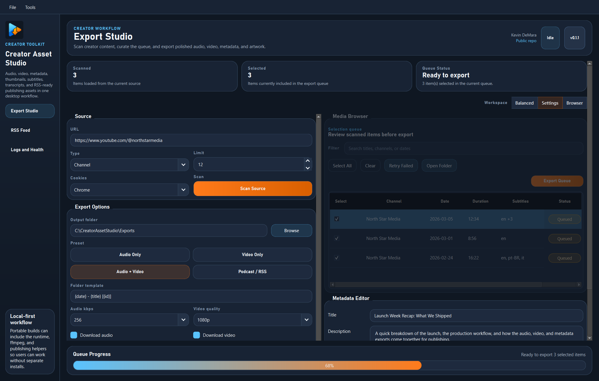
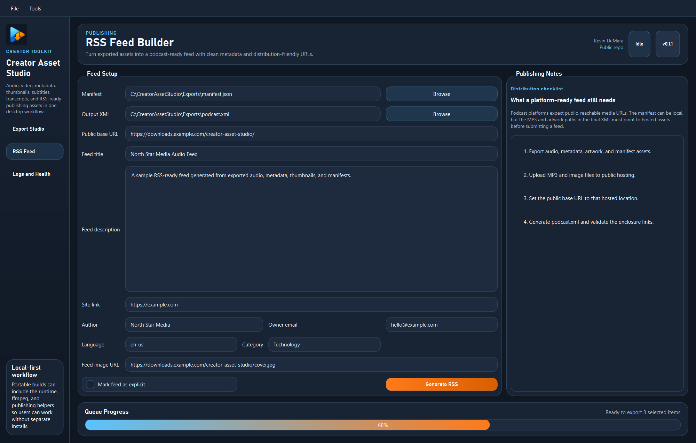
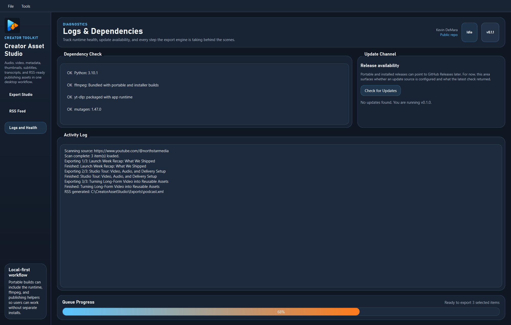

# Creator Asset Studio

Creator Asset Studio is a Windows desktop app for turning creator-owned YouTube content into organized export assets.

It can scan a channel, playlist, or single video, then export audio, video, thumbnails, descriptions, metadata, subtitles, transcripts, chapters, manifests, and RSS-ready assets from one workflow.

This public repository is the download and product-info home for the app. The source code is kept in a private repository.

Current public release: `v0.1.1`

## Download

- [Download the latest Windows installer](https://github.com/kevindemara/creator-asset-studio/releases/latest/download/CreatorAssetStudio-Setup.exe)
- [Browse all releases](https://github.com/kevindemara/creator-asset-studio/releases)

The installer is self-contained. End users do not need to install Python or `ffmpeg` separately.

## What's New In v0.1.1

- Refined Export Studio layout for better usability on standard desktop window sizes
- Adjustable workspace focus modes for settings vs. media browser
- Cleaner media browser table with the decorative preview column removed
- Updated branding, screenshots, and in-app credits
- Scan-start fix so queue scans no longer appear stuck at `0%`

## Features

- Scan before export for channels, playlists, and single videos
- Per-item selection before download/export
- Export presets for audio only, video only, audio plus video, and podcast/RSS-ready workflows
- Organized output folders with custom naming templates
- MP3 ID3 tagging and MP4 metadata tagging
- Thumbnail download and cover-art embedding
- Description, title, metadata JSON, subtitles, transcript text, and chapter export
- Manifest output as `manifest.json` and `manifest.csv`
- RSS feed builder for audio publishing workflows
- Retry failed exports and resume with skip-existing behavior
- Local-first workflow with installer-based distribution

## Screenshots

### Export Workflow

### RSS Builder

### Logs And Dependency View

## Installation

1. Download the latest installer from [Releases](https://github.com/kevindemara/creator-asset-studio/releases).
2. Run `CreatorAssetStudio-Setup.exe`.
3. Follow the installer prompts.
4. Launch Creator Asset Studio from the Start Menu or desktop shortcut.

## Source Code

The source code for Creator Asset Studio is private.

If you would like a copy of the source code, want to discuss licensing, or have partnership questions, contact Kevin DeMara at [kevin@eventidestudios.com](mailto:kevin@eventidestudios.com).

## Changelog

- [Changelog](CHANGELOG.md)
- [Release Notes](RELEASE_NOTES.md)

## Legal

- [Legal and Responsible Use Notice](LEGAL.md)
- [Repository License](LICENSE.md)

Creator Asset Studio is not affiliated with or endorsed by YouTube, Spotify, or Google.
